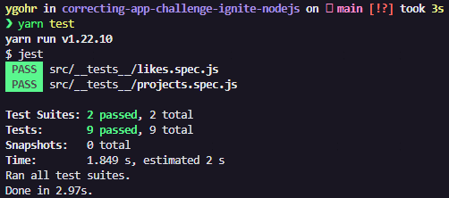

# ⚔️ Ignite - Desafio 3: Corrigindo Bugs/Problemas

<br>

## :pushpin: Sobre o Desafio
Este desafio tem como objetivo a correção de uma aplicação que está em processo de desenvolvimento mas que já possui os testes necessários para fazer toda a validação dos requisitos.
Essa aplicação realiza o **CRUD** (Create, Read, Update, Delete) de repositórios de **projetos**. Além disso, é possível dar _likes_ em repositórios cadastrados, aumentando a quantidade de likes em 1 a cada vez que a rota é chamada.
A estrutura de um repositório ao ser criado é a seguinte: 

- **id** deve ser um uuid válido;
- **title** é o título do repositório (por exemplo "unform");
- **url** é a URL que aponta para o repositório (por exemplo "[https://github.com/unform/unform](https://github.com/unform/unform)");
- **techs** é um array onde cada elemento deve ser uma string com o nome de uma tecnologia relacionada ao repositório (por exemplo: ["react", "react-native", "form"]);
- **likes** é a quantidade de likes que o repositório recebeu (e que vai ser incrementada de 1 em 1 a cada chamada na rota de likes).

O _template_ de arquivos utilizados neste projeto pode ser acessado em: [**template.**](https://github.com/rocketseat-education/ignite-template-corrigindo-o-codigo)

## 📋 Requisitos e Regras de Negócio
O documento de referência de Requisitos e Regras de Negócio pode acessado através deste [**link.**](https://www.notion.so/Requisitos-e-Regras-de-Neg-cio-Corrigindo-Bugs-Problemas-Desafio-3-Ignite-fd8fc60292394f11855e568edc156ef3)

## 💻 Instalação, Dependências e Executando o Projeto
**1.** Clone este repositório 
```
git clone https://github.com/Ygohr/correcting-app-challenge-ignite-nodejs
``` 
**2.** Vá até o diretório raiz do projeto
```
cd correcting-app-challenge-ignite-nodejs
``` 
**3.** Instale as dependências necessárias
```
yarn 
ou
npm install
```
**4.** Execute a aplicação
```
yarn dev
```

## :floppy_disk: Usando a Aplicação
Para realização de **requisições** na aplicação, deve ser utilizado o **Insomnia** ou **Postman**, importando o [arquivo](insomnia_requests) de requisições já existente neste diretório.
Atentar-se aos parâmetros necessários no **Header**.

## :syringe: Evidência de Testes
Nesta aplicação, são contemplados **Testes Unitários**, visando garantir o correto funcionamento das funcionalidades e manter a aplicação de acordo com os requisitos. <br/>



- **Desenvolvido** **por** [**Ygohr**](https://www.linkedin.com/in/ygohr-medeiros-28451b14a/) 🤖
